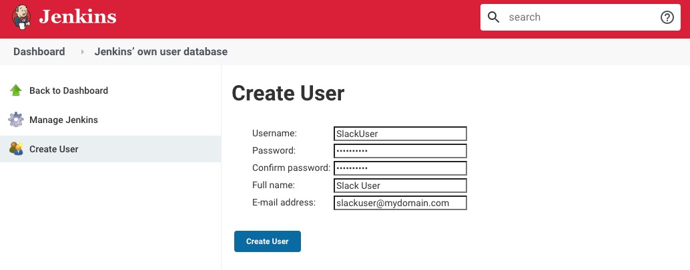
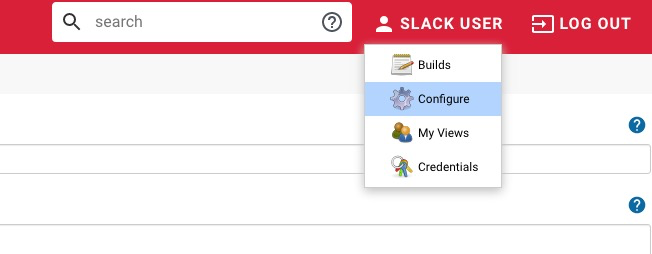
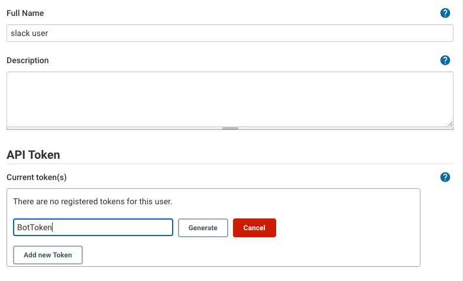
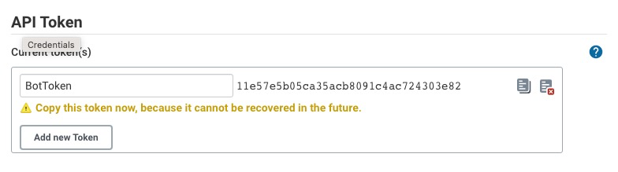
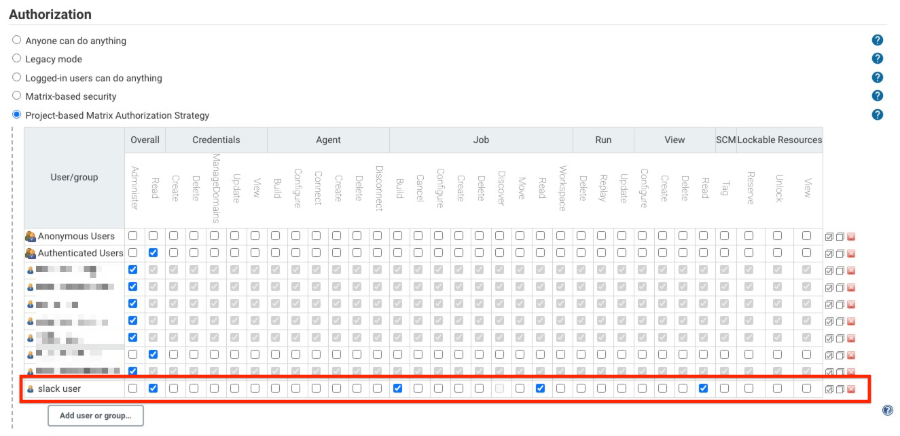
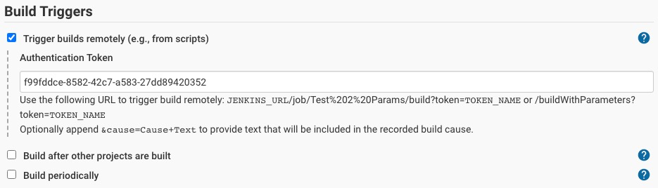

## JENKINS SETUP

### One time
- Create a Slack User in Jenkins
  - Admin user -> Manager Jenkins -> Manage Users -> Create User

- Create an Authentication Token for SlackUser
  - Login to Jenkins as SlackUser -> Click on the user and `Configure`

- In the configuration page, Go to the `API Token` Section and Add `New Token`

- Once clicked on the Generate button you would be presented with the API token as shown below.

- Save the token in .env variable `JENKINS_PASSWORD`

- Configure Global Security and Project-Based Matrix
  - Logout from the BuildUser and Log back in as Admin user
    - Manage Jenkins -> Configure Global Security -> Authorization -> Click on Add User or Group

- Generate uuid4 id (https://www.uuidgenerator.net/) and save in env variable `JENKINS_TOKEN`

### In every job
- Configure API token
  - In Job Configuration page, Below the `Build Triggers` section
    - Select the `Trigger builds remotely` and Enter your `JENKINS_TOKEN` previously created in `Authentication Token` as shown below.

